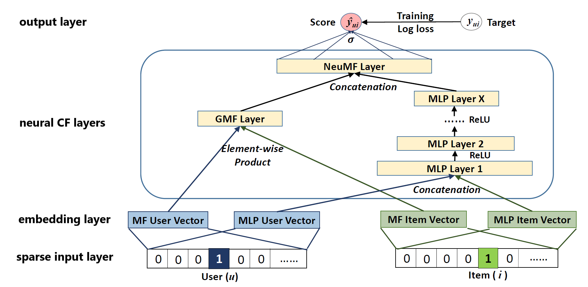
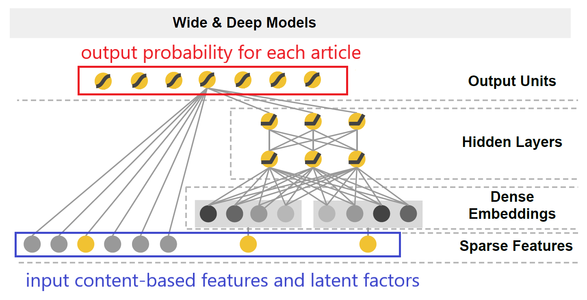
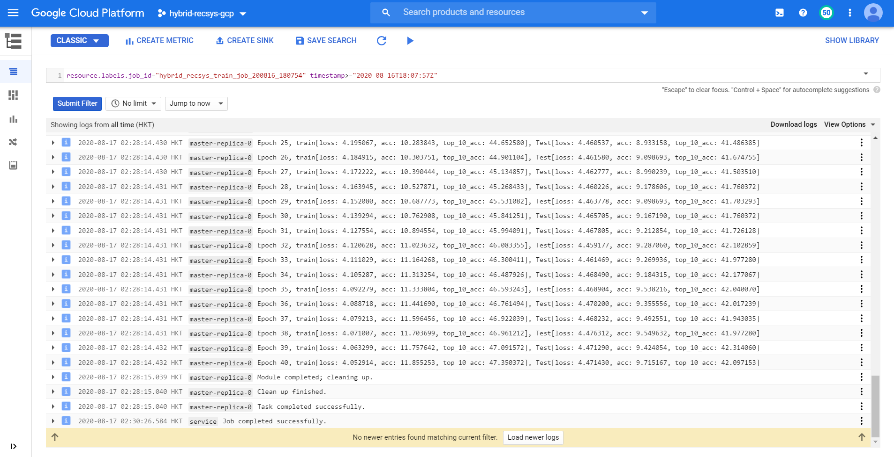
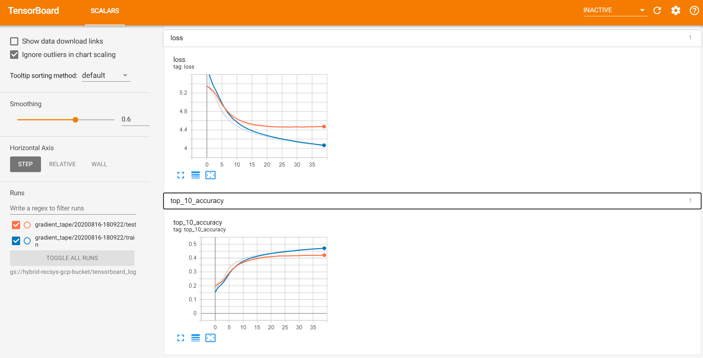

# Hybrid Recommendation System

## Overview
The objective of this notebook is to create news_recommend_dataset and build a hybrid recommedation system to recommend news for Austrian news website Kurier.at. Given the information of the current news article, the goal is to predict the next news article the visitor would like to read. First, use stadard SQL to query dataset and extract content-based features from Google analytics data in BigQuery. Next, extract embeddings from neural collaborative filtering to get user and item latent factors. After combining content-based features with latent factors, we employ wide & deep architecture to build a hybrid recommendation system and recommend the next news article for readers. The hybrid model is trained in gcloud ai-platform, and a gcloud model is created to allow batch prediction or online prediction with REST API.

(This project is implemented in python 3 and tensorflow 2 and is only for self-practice purpose.)

## Dependencies
1. python 3.6.9
2. tensorflow 2.1.0
3. BigQuery
4. Google Coud Platform

## Dataset
1. [cloud-training-demos.GA360_test.ga_sessions_sample](https://console.cloud.google.com/bigquery?p=cloud-training-demos&d=GA360_test&t=ga_sessions_sample&page=table): Public BigQuery dataset which contains Google analytics data from Austrian news website Kurier.at

2. [news_recommend_dataset](https://drive.google.com/drive/folders/1tYlHFazD2Z0AhwV8jlG28uH7lvfwNJKl?usp=sharing): Dataset combining preprocessed content-based features with user and item latent factors from neural collaborative filtering.

## How to run
1. Run preprocess.ipynb to preprocess dataset in BigQuery
2. Run neural_colaborate_filter_train.ipynb to extract user and item latent factors using neural collaborative filtering
3. Run hybrid_recsys_train.ipynb for creating hybrid model and perform batch and online predictions

## Paper
The implementation is related to the following papers:

1. [Neural Collaborative Filtering](https://arxiv.org/abs/1708.05031)

2. [Wide & Deep Learning for Recommender Systems](https://arxiv.org/abs/1606.07792)

## Implementation
1. The neural collaborative filtering is implemented using the below network architecture. It takes user id and item id to predict rating for the item.

   

2. The hybrid model is implemented using the below network architecture. It takes content-based features and latent factors to predict the probability of each next items which the user may like to read.

   

## Result
1. The traing job log file is shown below. The final test result is loss: 4.471430, acc: 9.715167, top_10_acc: 42.097153. The top 10 accuracy is around 42.3%, which means our model has 42.3% chance to correcly predict the next news article the visitor would like to view if our hybrid recommendation model recommend 10 items. While randomly picking 10 items from total 2421 news articles, the top 10 accuracy would only be 0.413%. Our modle is 100 times better in top 10 accuracy than random picking.

   

2. The tensorboard of the training process is shown below

   

## Reference
This project is inspired by the following resources:

1. [Neural Collaborative Filtering](https://arxiv.org/abs/1708.05031)

2. [Wide & Deep Learning for Recommender Systems](https://arxiv.org/abs/1606.07792)

3. [Recommendation Systems with TensorFlow on GCP](https://www.coursera.org/learn/recommendation-models-gcp)

4. [End-to-end Machine Learning with TensorFlow on GCP](https://github.com/GoogleCloudPlatform/training-data-analyst/tree/master/courses/machine_learning/deepdive/06_structured)

5. [Collaborative Filtering using Deep Neural Networks (in Tensorflow)](https://medium.com/@victorkohler/collaborative-filtering-using-deep-neural-networks-in-tensorflow-96e5d41a39a1)

6. [Get started with TensorBoard](https://www.tensorflow.org/tensorboard/get_started?hl=en)

7. [Deploying models](https://cloud.google.com/ai-platform/prediction/docs/deploying-models#gcloud)

8. [Method: projects.predict](https://cloud.google.com/ai-platform/prediction/docs/reference/rest/v1/projects/predict)
